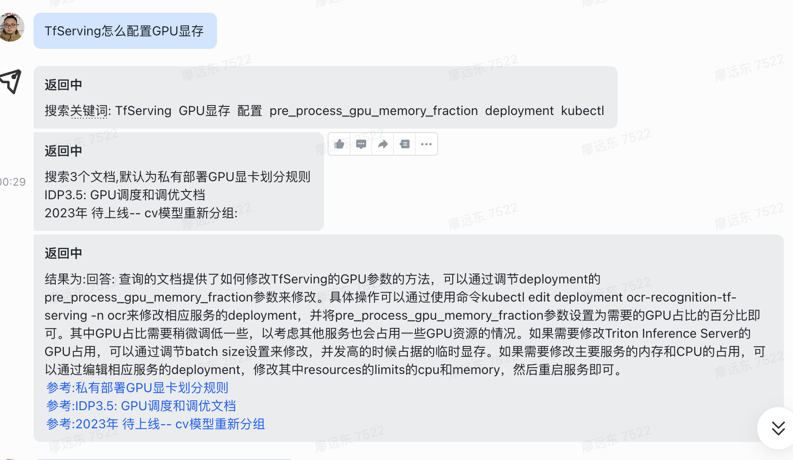

# 此工具目标
模拟NewBing的搜索操作,搜索飞书内网文档，并返回结果

# Show

# 备注
1. 没有用langchian。是go的langchain库(golangchian)等同于残废。确实只有python的库比较好。   
2. 代码质量确实比较差。暂时没有优化使用。谨慎使用
3. 本人只测试过Azure的gpt-3.5-turbo 其他模型有bug可以反馈

# 工具流程
0. 用户进行登录
1. 用户的输入进入ChatGPT进行翻译(辅助API文档)
2. 调用飞书的API进行搜索
3. 把结果分析给ChatGPT
4. 得出结果返回给用户

# 配置
机器人调用地址为 http://ip:port/event  
授权地址为 http://ip:port/auth

## 权限
im:*  建议消息所有权限  
docs:*readonly,sheets:*readonly,drive:*readonly,wiki:*readonly  文档所有只读权限

# 配置
参考相应的  
.feishu.env  
.chatgpt.env 